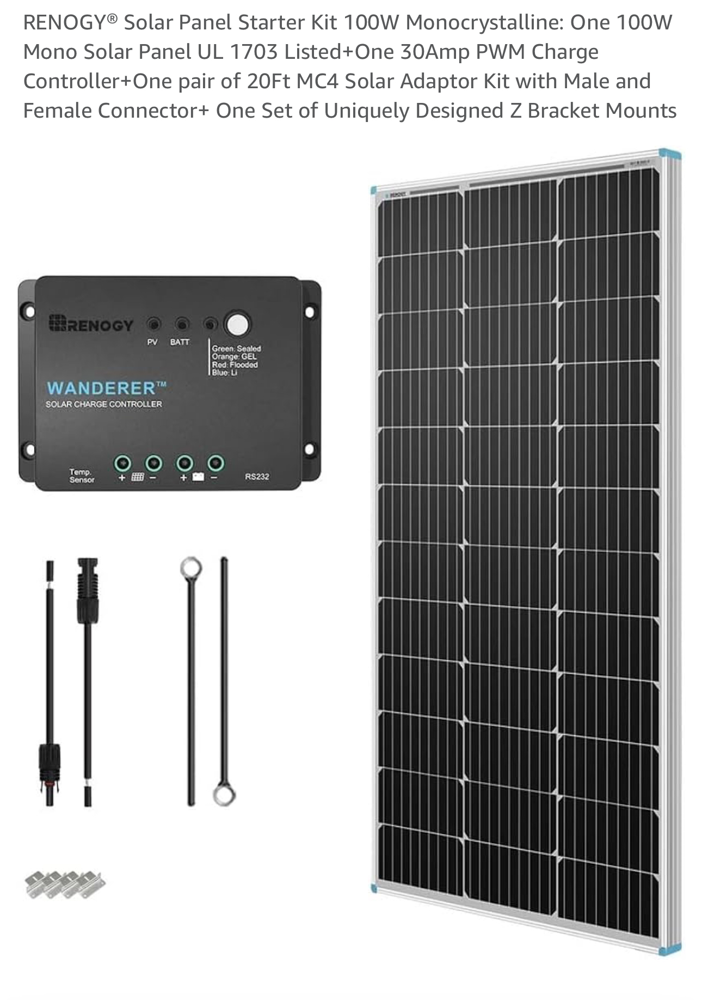

# Renogy Wanderer 30A ESPhome Integration

This project integrates the [Renogy Wanderer 30A charge controller](https://amzn.to/49AiwHF) with ESPHome for enhanced monitoring and control in Home Assistant.

I found inspiration with [wrybread project](https://github.com/wrybread/ESP32ArduinoRenogy/tree/main)

To get the data, you need to grab the data from the RS232 port. A normal [RJ12 cable](https://amzn.to/3OSy67P) will do the trick

Next, you can use a [connection box](https://amzn.to/41t3C3V) to easily connect to your cable

