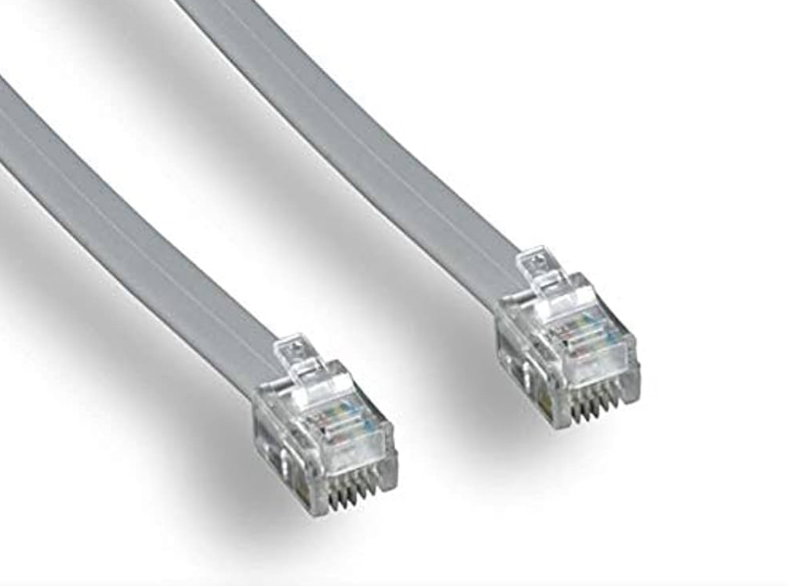
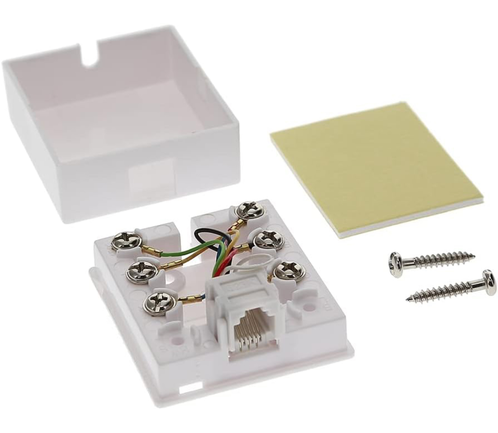
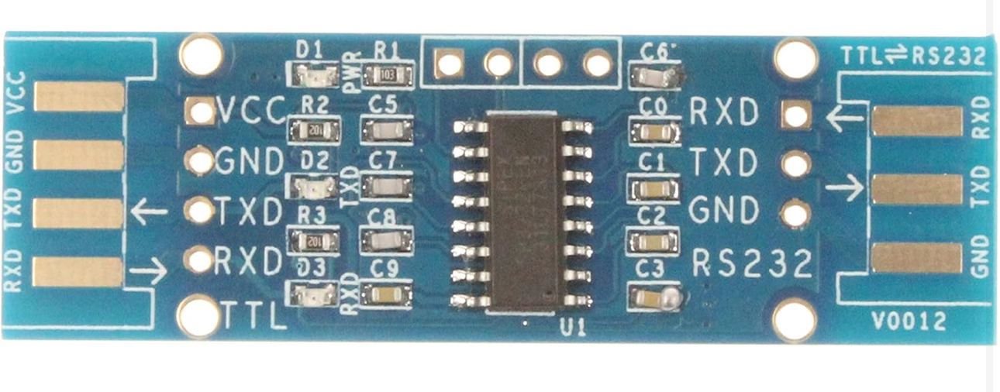
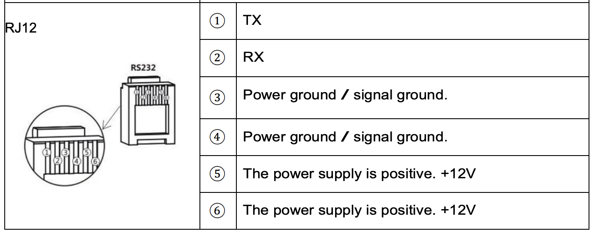

# Renogy Wanderer 30A ESPhome Integration

This project integrates the [Renogy Wanderer 30A charge controller](https://amzn.to/49AiwHF) with ESPHome for enhanced monitoring and control in Home Assistant.

This project was inspired by and references:

[wrybread project](https://github.com/wrybread/ESP32ArduinoRenogy)

[sophienyaa project](https://github.com/sophienyaa/NodeRenogy)

## Requirement

To retrieve data, you’ll need to access the RS232 port. A standard [RJ12 cable](https://amzn.to/3OSy67P) will work.

Next, you can use a [connection box](https://amzn.to/41t3C3V) to easily connect the cable

To convert RS232 data for use with an ESP32, you’ll need an [RS232 to TTL module](https://amzn.to/4gavRcb)

Here’s the tricky part! Use a multimeter to check the voltage on the RJ12 cable when it’s plugged into the Renogy controller. Then, match the pin order as shown below:

## Wiring Connections

ESP32 to TTL Side Module:
|ESP32|TTL side Module|
|--------|-----------|
|TX on ESP32|RX on module|
|RX on ESP32|TX on module|
|3.3V on esp32|VCC on module|
|GND on ESP32|GND on module|

RS232 Side Module to RJ12 Cable:  
|RS232 side module|RJ12 Cable|
|--------|-----------|
|RX on module|TX on cable|
|TX on module|RX on cable|
|GND on module|GND on cable|

If you want to power the ESP32 directly from the cable, you can use  [mini buck dc to dc converter](https://amzn.to/4ityJCo)

## Software Configuration
Connect your esp32 to your computer, install ESPHOME and [use this code](https://github.com/mlevac21/Renogy-Wanderer-30a-Esphome/blob/main/code)

## Available Data
Below is the list of registers you can access, as detailed in the [from sophienyaa project](https://github.com/sophienyaa/NodeRenogy)

Device Information
|Register|Description|Unit|
|--------|-----------|-----|
|0x00A|Controller voltage rating|Volts|
|0x00A|Controller current rating|Amps|
|0x00B|Controller discharge current rating|Amps|
|0x00B|Controller type||
|0x00C - 0x013|Controller model name||
|0x014 - 0x015|Controller software version||
|0x016 - 0x017|Controller hardware version||
|0x018 - 0x019|Controller serial number||
|0x01A|Controller MODBUS address||

State Data
|Register|Description|Unit|
|--------|-----------|-----|
|0x100|Battery Capacity|Percent|
|0x101|Battery Voltage|Volts|
|0x102|Battery Charge Current|Amps|
|0x103|Battery Temperature|Celcius|
|0x103|Controller Temperature|Celcius|
|0x104|Load Voltage|Volts|
|0x105|Load Current|Amps|
|0x106|Load Power|Watts|
|0x107|Solar Panel (PV) Voltage|Volts|
|0x108|Solar Panel (PV) Current|Amps|
|0x109|Solar Panel (PV) Power|Watts|
|0x10B|Min Battery Voltage Today|Volts|
|0x10C|Min Battery Voltage Today|Volts|
|0x10D|Max Charge Current Today|Amps|
|0x10E|Max Discharge Current Today|Amps|
|0x10F|Max Charge Power Today|Watts|
|0x110|Max Discharge Power Today|Watts|
|0x111|Charge Amp/Hrs Today|Amp Hours|
|0x112|Discharge Amp/Hrs Today|Amp Hours|
|0x113|Charge Watt/Hrs Today|Watt Hours|
|0x114|Discharge Watt/Hrs Today|Watt Hours|
|0x115|Controller Uptime|Days|
|0x116|Total Battery Over-charges|Count|
|0x117|Total Battery Full Charges|Count|

## Hope everything work flawlesly!
